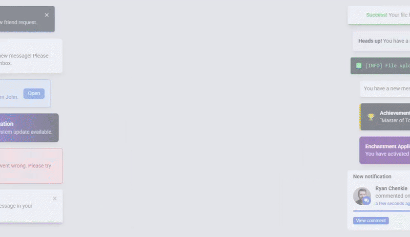

[](https://solid-notifications.vercel.app/)

A SolidJS Toast Notifications Library




Lightweight, customizable, and easy-to-use toast notification library for **SolidJS** applications.

## Features

- **Simple API**: Easily create and manage toast notifications with just a few lines of code.
- **Customizable**: Fully customizable styles, positions, behaviors and much more.
- **Lightweight**: Minimal footprint with zero unnecessary dependencies (just 7kb gzipped).
- **Multiple Toasters support**: Seamlessly manage multiple independent toasters in your app for diverse notification needs, all within a single setup.
- **TypeScript Support**: Comes with built-in TypeScript types for a better developer experience.

## Getting Started

To get started with Solid Notifications, visit the official documentation website:

📚 **[View Documentation](https://solid-notifications.vercel.app/)**

The documentation includes installation instructions, usage examples, API reference, and customization guides.

## Installation

You can install Solid Notifications via npm:

```bash
npm install solid-notifications
```

### Peer Dependencies

Solid Notifications requires `solid-js` as a peer dependency. Make sure you have it installed:

```bash
npm install solid-js
```

## Quick Example

Here's a quick example to show how easy it is to use:

1. Mount the ToastProvider and Toaster components:

   ```tsx
   import { ToastProvider, Toaster } from "solid-notifications";

   export default function App(props) {
     return (
       <ToastProvider>
         <Toaster />
         {props.children}
       </ToastProvider>
     );
   }
   ```

2. Import the Solid Notifications css file into your main css file:

   ```css
   /* index.css */

   @import "solid-notifications/index.css";
   ```

3. Create toasts:

   ```tsx
   import { useToast } from "solid-notifications";

   export default function AppContent() {
     const { notify } = useToast();

     return (
       <div>
         <button onClick={() => notify("🚀 New toast ready to serve!")}>
           Create a Toast!
         </button>
       </div>
     );
   }
   ```

For more examples and advanced usage, check out the [documentation](https://solid-notifications.vercel.app/).

## Development

If you'd like to contribute to Solid Notifications, follow these steps to set up the project locally:

1. **Clone the repository**:
   First, grab a copy of the project by cloning the repository:

   ```bash
   git clone https://github.com/Nyloth9/solid-notifications.git
   cd solid-notifications
   ```

2. **Install dependencies:** Next, install all the necessary dependencies to get things up and running:

   ```bash
   npm install
   ```

3. **Run the playground:** To test your changes or experiment with the library, start the development server:

   ```bash
   npm run dev
   ```

   This will launch the playground where you can see your changes in real-time.

4. **Edit the website:** To preview or test the documentation, navigate to the website folder and start the development server:

   ```bash
   cd website
   npm install
   npm run dev
   ```

## License

This project is licensed under the **MIT License**.
